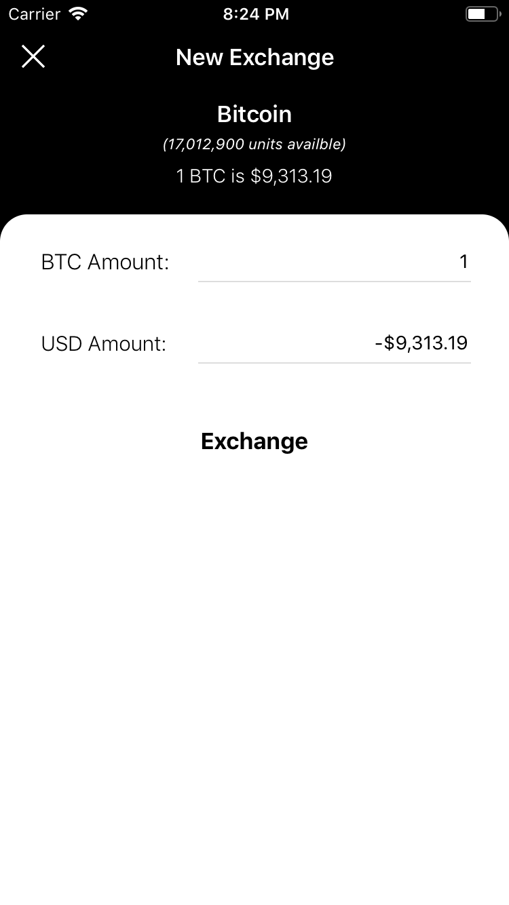

# KEY FEATURES #
- Developed using MVVM.
- A black theme that looks amazing with the iPhones with OLED display and the old ones to.
- Displays all the currencies available at the API using a scrolled pagination.
- Displays all the Cryptocurrency historical data and shows it in a Chart.
- Allows simple buy and sell Cryptocurrencies getting directly their cost in USD that the user will get in the exchange.
- Easy offline access to the user Portfolio. (This feature is possible downloading and storing all the coin detail missing from the Portfolio request like the cryptocurrency name).

# PROJECT COMPATIBILITY #

- Requires the new Xcode 12.
- Requires Cocoapod.

## External dependencies ##

1. [<b>Alamofire:</b>](https://github.com/Alamofire/Alamofire) for handling the remote request.
1. [<b>Charts:</b>](https://github.com/danielgindi/Charts) for displaying the coin historical chart.
1. [<b>CDAlertView:</b>](https://github.com/candostdagdeviren/CDAlertView) for displaying alert popup.
1. [<b>Realm</b>](https://realm.io/docs/swift/latest/) as local Database.
1. [<b>JustHUD:</b>](https://github.com/shubh10/JustHUD) for displaying a blocking HUD.

# Screenshots #

